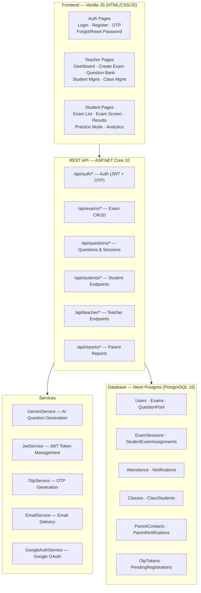

# EdTech App — System Design

**Note:** This file previously described an old Node/Express/Sequelize/React Native stack that no longer reflects the codebase. The current tech stack is documented below.

## Current Architecture

## Tech Stack

| Layer | Technology |
|-------|-----------|
| Backend | ASP.NET Core 10 (C#) |
| Database | PostgreSQL 16 (Neon) |
| ORM | Dapper + Npgsql |
| Auth | JWT + OTP (Email) + Google OAuth |
| AI | Google Gemini API |
| Frontend | Vanilla HTML, CSS, JavaScript |
| Deployment | Railway (backend), Vercel (frontend) |

## Key Design Decisions

- **Custom JWT middleware** instead of ASP.NET Identity for lightweight auth
- **Dapper** over EF Core for performance on exam queries
- **Role-based auth** via `[RequireAuth]` and `[RequireRole]` attributes
- **Neon Postgres** with pooled connection for serverless compatibility
- **Gemini AI** for automated question/exam generation
