# EdTech App — System Design

```mermaid
flowchart TD
    %% ========================
    %% CLIENT LAYER
    %% ========================
    subgraph CLIENT["📱 Client Layer — React Native (Expo SDK 54)"]
        direction TB
        A1["Auth Screens<br/>Login · Register · OTP<br/>Forgot/Reset Password"]
        A2["Teacher Screens<br/>Dashboard · Create Exam · Exam Detail<br/>Question Bank · Student Mgmt · Class Mgmt<br/>Parent Mgmt · Announcements · Reports"]
        A3["Student Screens<br/>Exam List · Exam Screen · Results<br/>Practice Mode · Analytics · Exam Review<br/>Notifications · Profile"]
        A4["Shared UI Components<br/>Button · Card · Input · Badge · Header<br/>StatCard · ProgressBar · Loading<br/>EmptyState · ScreenWrapper"]
        A5["Exam Components<br/>ExamTimer · QuestionCard · QuestionPalette<br/>QuestionNavigation · ExamTopBar<br/>ExamDisqualifiedView · OfflineBanner · OtpInput"]
        A6["Custom Hooks<br/>useExamSession · useCountdownTimer<br/>useAppStateGuard · useScreenCaptureGuard<br/>useNetworkStatus"]
        A7["Services<br/>api.ts · auth.ts · storage.ts"]
    end

    %% ========================
    %% NETWORK LAYER
    %% ========================
    subgraph NETWORK["🌐 Network Layer — HTTPS / REST JSON"]
        B1["POST /api/auth/*<br/>Login · Register · OTP · Passwords"]
        B2["GET/POST/PUT/DELETE /api/exams/*<br/>CRUD · Activate · Deep Link · Stats<br/>Attendance · PDF Export · Bulk Import"]
        B3["POST /api/questions/*<br/>Generate (AI) · Assign · Sessions<br/>Submit · Disqualify · Results"]
        B4["GET/POST /api/students/*<br/>Analytics · Review · Practice<br/>Notifications"]
        B5["GET/POST/PUT/DELETE /api/teacher/*<br/>Students · Questions · Classes<br/>Announcements · Parents · Export"]
        B6["POST/GET /api/reports/*<br/>Send Reports · Pending Reports<br/>Test SMS/Email"]
    end

    %% ========================
    %% BACKEND LAYER
    %% ========================
    subgraph BACKEND["⚙️ Backend — Express.js (Node.js)"]
        direction TB

        subgraph MIDDLEWARE["Middleware Stack"]
            C1["Helmet<br/>Security Headers"]
            C2["CORS<br/>Cross-Origin"]
            C3["Rate Limiter<br/>100 req / 15 min / IP"]
            C4["Morgan + Winston<br/>HTTP & App Logger"]
            C5["Multer<br/>PDF Upload (≤10MB)"]
            C6["JWT Auth<br/>verifyJWT Middleware"]
            C7["Role Guard<br/>teacher / student"]
            C8["express-validator<br/>Input Validation"]
        end

        subgraph CONTROLLERS["Controllers"]
            D1["authController.js<br/>OTP gen/verify · Register<br/>Login · Forgot/Reset Password<br/>Profile Update · Change Password"]
            D2["examController.js<br/>CRUD · Activate/Close · Deep Link<br/>Bulk Import (CSV) · PDF Export<br/>Syllabus Upload · Statistics<br/>Attendance Report"]
            D3["questionController.js<br/>AI Generate (Gemini) · Assign<br/>Create Session · Submit & Grade<br/>Disqualify · Results"]
            D4["aiController.js<br/>Gemini API integration<br/>PDF text extraction<br/>Multi-model fallback"]
            D5["teacherController.js<br/>Student CRUD · Question Bank<br/>Class Mgmt · Announcements<br/>Parent Contacts · Export JSON"]
            D6["studentController.js<br/>Analytics · Exam Review<br/>Practice Mode · Notifications"]
            D7["reportsController.js<br/>Send Reports (SMS/Email)<br/>Pending Reports · Test"]
        end

        subgraph ROUTES["Route Handlers"]
            E1["/api/auth → authRoutes"]
            E2["/api/exams → examRoutes"]
            E3["/api/questions → questionRoutes"]
            E4["/api/students → studentRoutes"]
            E5["/api/teacher → teacherRoutes"]
            E6["/api/reports → reportRoutes"]
        end

        subgraph UTILS["Utilities"]
            F1["jwt.js<br/>Token Sign/Verify"]
            F2["otp.js<br/>Generate/Validate OTP"]
            F3["environment.js<br/>Env Config"]
            F4["database.js<br/>Sequelize + PostgreSQL"]
        end
    end

    %% ========================
    %% DATABASE LAYER
    %% ========================
    subgraph DB["🗄️ Database — PostgreSQL (Sequelize ORM)"]
        direction TB
        G1["Users<br/>id · name · role · phone<br/>email · password"]
        G2["OTP Tokens<br/>user_id · otp_code<br/>expires_at · is_used"]
        G3["Pending Registrations<br/>name · identifier · role<br/>password_hash · otp_code"]
        G4["Exams<br/>teacher_id · title · subject<br/>syllabus · duration · question_count<br/>deep_link_code · status<br/>scheduled_at · allow_reattempt"]
        G5["Question Pool<br/>exam_id · question_text<br/>option A/B/C/D · correct_answer<br/>difficulty · points · status"]
        G6["Student Exam Assignments<br/>student_id · exam_id<br/>question_ids (JSON)"]
        G7["Exam Sessions<br/>student_id · exam_id · score<br/>status · answers (JSON)<br/>time_remaining · mode<br/>ip_address · user_agent"]
        G8["Attendance<br/>student_id · exam_id<br/>status · marked_by"]
        G9["Parent Contacts<br/>student_id · parent_name<br/>parent_phone · parent_email"]
        G10["Parent Notifications<br/>student_id · exam_id<br/>message · sent_via · status"]
        G11["Notifications<br/>user_id · title · message<br/>type · is_read · metadata"]
        G12["Classes<br/>teacher_id · name · subject<br/>description"]
        G13["Class_Students<br/>classId · studentId"]
    end

    %% ========================
    %% EXTERNAL SERVICES
    %% ========================
    subgraph EXTERNAL["🔗 External Services"]
        H1["Google Gemini API<br/>AI Question Generation<br/>gemin-2.0-flash · 1.5-flash<br/>1.5-pro · gemini-pro"]
        H2["Twilio API<br/>SMS OTP Delivery<br/>Parent Report SMS"]
        H3["SendGrid API<br/>Email OTP Delivery<br/>Parent Report Email"]
        H4["NodeMailer (SMTP)<br/>Fallback Email Delivery"]
    end

    %% ========================
    %% SCHEDULED / BACKGROUND
    %% ========================
    subgraph SCHEDULED["⏰ Cron Jobs"]
        I1["node-cron (every min)<br/>Auto-activate scheduled exams<br/>draft → active"]
    end

    %% ========================
    %% CONNECTIONS
    %% ========================

    %% Client → Network
    A1 ---|"HTTPS REST"| B1
    A2 ---|"HTTPS REST"| B2
    A2 ---|"HTTPS REST"| B3
    A2 ---|"HTTPS REST"| B5
    A2 ---|"HTTPS REST"| B6
    A3 ---|"HTTPS REST"| B2
    A3 ---|"HTTPS REST"| B3
    A3 ---|"HTTPS REST"| B4
    A7 ---|"Axios HTTP Client"| B1
    A7 ---|"Axios HTTP Client"| B2
    A7 ---|"Axios HTTP Client"| B3
    A7 ---|"Axios HTTP Client"| B4
    A7 ---|"Axios HTTP Client"| B5
    A7 ---|"Axios HTTP Client"| B6

    %% Network → Backend
    B1 -->|"Routes to"| E1
    B2 -->|"Routes to"| E2
    B3 -->|"Routes to"| E3
    B4 -->|"Routes to"| E4
    B5 -->|"Routes to"| E5
    B6 -->|"Routes to"| E6

    %% Backend internal flow
    E1 --->|"Pass through"| C6
    E2 --->|"Pass through"| C6
    E3 --->|"Pass through"| C6
    E4 --->|"Pass through"| C6
    E5 --->|"Pass through"| C6
    E6 --->|"Pass through"| C6

    C6 -->|"Authenticated"| C7
    C7 -->|"Authorized"| D1
    C7 -->|"Authorized"| D2
    C7 -->|"Authorized"| D3
    C7 -->|"Authorized"| D4
    C7 -->|"Authorized"| D5
    C7 -->|"Authorized"| D6
    C7 -->|"Authorized"| D7

    C5 --> D2
    C5 --> D4

    %% Controllers → Database
    D1 -->|"Sequelize ORM"| G1
    D1 -->|"Sequelize ORM"| G2
    D1 -->|"Sequelize ORM"| G3
    D2 -->|"Sequelize ORM"| G4
    D2 -->|"Sequelize ORM"| G8
    D3 -->|"Sequelize ORM"| G5
    D3 -->|"Sequelize ORM"| G6
    D3 -->|"Sequelize ORM"| G7
    D3 -->|"Sequelize ORM"| G8
    D5 -->|"Sequelize ORM"| G1
    D5 -->|"Sequelize ORM"| G4
    D5 -->|"Sequelize ORM"| G5
    D5 -->|"Sequelize ORM"| G9
    D5 -->|"Sequelize ORM"| G12
    D5 -->|"Sequelize ORM"| G13
    D5 -->|"Sequelize ORM"| G11
    D6 -->|"Sequelize ORM"| G7
    D6 -->|"Sequelize ORM"| G11
    D7 -->|"Sequelize ORM"| G9
    D7 -->|"Sequelize ORM"| G10

    %% Controllers → External Services
    D4 -->|"HTTPS REST (Axios)"| H1
    D1 ---|"Twilio SDK"| H2
    D1 ---|"SendGrid SDK"| H3
    D1 ---|"NodeMailer"| H4
    D7 ---|"Twilio SDK"| H2
    D7 ---|"SendGrid SDK"| H3

    %% Scheduled Tasks
    I1 -->|"Updates"| G4

    %% Styling
    classDef client fill:#e1f5fe,stroke:#0288d1,stroke-width:2px
    classDef network fill:#fff3e0,stroke:#f57c00,stroke-width:2px
    classDef backend fill:#e8f5e9,stroke:#388e3c,stroke-width:2px
    classDef db fill:#fce4ec,stroke:#c62828,stroke-width:2px
    classDef external fill:#f3e5f5,stroke:#7b1fa2,stroke-width:2px
    classDef cron fill:#fff8e1,stroke:#f9a825,stroke-width:2px

    class A1,A2,A3,A4,A5,A6,A7 client
    class B1,B2,B3,B4,B5,B6 network
    class C1,C2,C3,C4,C5,C6,C7,C8,D1,D2,D3,D4,D5,D6,D7,E1,E2,E3,E4,E5,E6,F1,F2,F3,F4 backend
    class G1,G2,G3,G4,G5,G6,G7,G8,G9,G10,G11,G12,G13 db
    class H1,H2,H3,H4 external
    class I1 cron
```



## Network Request Flow

```
┌─────────────────────────────────────────────────────────────────┐
│                     MOBILE APP (Expo/React Native)              │
│                                                                 │
│  ┌─────────────┐  ┌──────────────┐  ┌───────────────────────┐  │
│  │ Auth Screens │  │Teacher Screens│  │ Student Screens       │  │
│  │ Login/Reg/   │  │Dashboard/    │  │Exam/Practice/         │  │
│  │ OTP/Password │  │Exam/Students/│  │Analytics/Reviews/     │  │
│  │              │  │Classes/      │  │Notifications/Profile  │  │
│  └──────┬──────┘  │Parents       │  └──────────┬────────────┘  │
│         │         └──────┬───────┘             │               │
│         └────────────────┼─────────────────────┘               │
│                          │                                      │
│                    ┌─────┴──────┐                              │
│                    │  api.ts    │ <── Axios HTTP Client         │
│                    │  auth.ts   │     with JWT Bearer Token     │
│                    │  storage.ts│                              │
│                    └─────┬──────┘                              │
└──────────────────────────┼─────────────────────────────────────┘
                           │
              HTTPS (443)  │  JSON Request/Response
                           │
┌──────────────────────────┼─────────────────────────────────────┐
│                     BACKEND SERVER (Express.js)                │
│                          │                                      │
│  ┌───────────────────────┴──────────────────────────────┐      │
│  │              MIDDLEWARE PIPELINE                      │      │
│  │  Helmet → CORS → Rate Limiter → Logger → Multer      │      │
│  │  → JWT Auth → Role Guard → Validator → Controller    │      │
│  └───────────────────────┬──────────────────────────────┘      │
│                          │                                      │
│  ┌───────────────────────┴──────────────────────────────┐      │
│  │                    CONTROLLERS                        │      │
│  │  authController → examController → questionController │      │
│  │  teacherController → studentController → reports      │      │
│  └───────────────────────┬──────────────────────────────┘      │
│                          │                                      │
│  ┌───────────────────────┴──────────────────────────────┐      │
│  │              SEQUELIZE ORM (PostgreSQL)               │      │
│  │  12 Models · Migrations · Query Building             │      │
│  └───────────────────────┬──────────────────────────────┘      │
└──────────────────────────┼─────────────────────────────────────┘
                           │
              TCP 5432     │  PostgreSQL Wire Protocol
                           │
┌──────────────────────────┴─────────────────────────────────────┐
│                     POSTGRESQL DATABASE                        │
│  ┌──────┐ ┌──────┐ ┌──────┐ ┌──────┐ ┌──────┐ ┌──────┐      │
│  │Users │ │Exams │ │QsPool│ │Sess. │ │Attnd.│ │Parent│      │
│  └──────┘ └──────┘ └──────┘ └──────┘ └──────┘ └──────┘      │
│  ┌──────┐ ┌──────┐ ┌──────┐ ┌──────┐ ┌──────┐ ┌──────┐      │
│  │Notify│ │Class │ │OTP   │ │Assign│ │Parent│ │Pending│      │
│  │      │ │      │ │      │ │ments │ │Notify│ │Regis. │      │
│  └──────┘ └──────┘ └──────┘ └──────┘ └──────┘ └──────┘      │
└────────────────────────────────────────────────────────────────┘

External Integrations (from Backend):
  ┌─────────────┐    ┌────────────┐    ┌────────────┐
  │ Gemini AI   │    │  Twilio    │    │ SendGrid   │
  │ (Question   │    │ (SMS OTP + │    │ (Email OTP +│
  │ Generation) │    │  Reports)  │    │  Reports)  │
  └─────────────┘    └────────────┘    └────────────┘
```

## Request Lifecycle Example

```
Step 1: Student opens exam
         │
Step 2: Mobile app calls POST /api/questions/create-session
         │  Headers: { Authorization: "Bearer <JWT>" }
         │  Body: { examId: 42 }
         │
Step 3: Express receives request
         │
Step 4: Helmet sets security headers
         │
Step 5: CORS validates origin
         │
Step 6: Rate limiter checks IP (max 100/15min)
         │
Step 7: Morgan logs the request
         │
Step 8: JWT middleware verifies token → decoded { userId, role }
         │
Step 9: Role guard checks role === "student"
         │
Step 10: express-validator validates body params
         │
Step 11: questionController.createSession() runs:
           ├── Checks exam exists & is active
           ├── Checks existing session (resume if in_progress)
           ├── Loads assigned questions from student_exam_assignments
           ├── Creates exam_sessions record (status: "in_progress")
           ├── Marks attendance (present)
           └── Returns session data + questions
         │
Step 12: Response sent as JSON
         │
Step 13: Morgan logs the response
```

This diagram covers the complete architecture with all 12 database tables, 50+ API endpoints, middleware pipeline, external service integrations, and the full request lifecycle.
