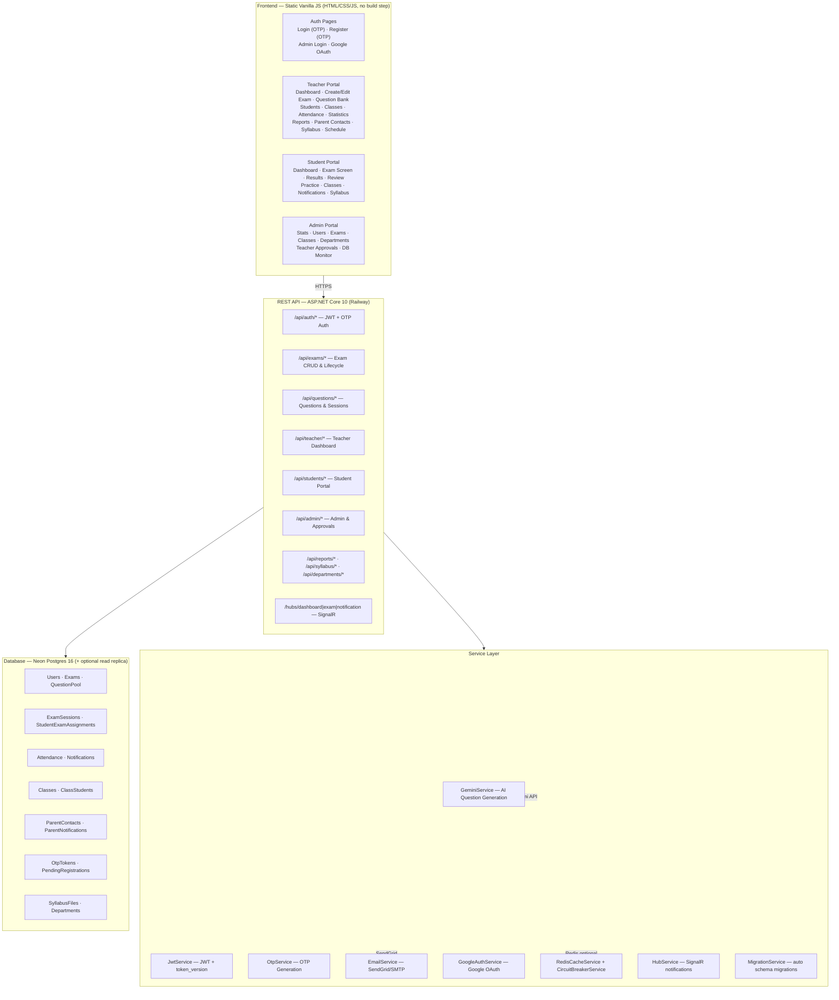

# EdTech App — System Design

**Note:** This file previously described an old Node/Express/Sequelize/React Native stack that no longer reflects the codebase. The current tech stack is documented below.

## Current Architecture

```mermaid
flowchart TD
    subgraph CLIENT["Frontend — Static Vanilla JS (HTML/CSS/JS, no build step)"]
        A1["Auth Pages<br/>Login (OTP) · Register (OTP)<br/>Admin Login · Google OAuth"]
        A2["Teacher Portal<br/>Dashboard · Create/Edit Exam · Question Bank<br/>Students · Classes · Attendance · Statistics<br/>Reports · Parent Contacts · Syllabus · Schedule"]
        A3["Student Portal<br/>Dashboard · Exam Screen · Results · Review<br/>Practice · Classes · Notifications · Syllabus"]
        A4["Admin Portal<br/>Stats · Users · Exams · Classes · Departments<br/>Teacher Approvals · DB Monitor"]
    end

    subgraph API["REST API — ASP.NET Core 10 (Railway)"]
        B1["/api/auth/* — JWT + OTP Auth"]
        B2["/api/exams/* — Exam CRUD & Lifecycle"]
        B3["/api/questions/* — Questions & Sessions"]
        B4["/api/teacher/* — Teacher Dashboard"]
        B5["/api/students/* — Student Portal"]
        B6["/api/admin/* — Admin & Approvals"]
        B7["/api/reports/* · /api/syllabus/* · /api/departments/*"]
        B8["/hubs/dashboard|exam|notification — SignalR"]
    end

    subgraph SERVICES["Service Layer"]
        C1["GeminiService — AI Question Generation"]
        C2["JwtService — JWT + token_version"]
        C3["OtpService — OTP Generation"]
        C4["EmailService — SendGrid/SMTP"]
        C5["GoogleAuthService — Google OAuth"]
        C6["RedisCacheService + CircuitBreakerService"]
        C7["HubService — SignalR notifications"]
        C8["MigrationService — auto schema migrations"]
    end

    subgraph DB["Database — Neon Postgres 16 (+ optional read replica)"]
        D1["Users · Exams · QuestionPool"]
        D2["ExamSessions · StudentExamAssignments"]
        D3["Attendance · Notifications"]
        D4["Classes · ClassStudents"]
        D5["ParentContacts · ParentNotifications"]
        D6["OtpTokens · PendingRegistrations"]
        D7["SyllabusFiles · Departments"]
    end

    CLIENT -->|HTTPS| API
    API --> SERVICES
    API --> DB
    SERVICES -->|Redis optional| C6
    SERVICES -->|Gemini API| C1
    SERVICES -->|SendGrid| C4
```

## Tech Stack

| Layer | Technology |
|-------|-----------|
| Backend | ASP.NET Core 10 (C#) |
| Database | PostgreSQL 16 (Neon) + optional read replica |
| ORM | Dapper + Npgsql |
| Auth | JWT (with `token_version` invalidation) + OTP (SendGrid) + Google OAuth |
| AI | Google Gemini API |
| Caching | Redis (optional, circuit-breaker fallback to DB) |
| Realtime | SignalR (dashboard, exam, notification hubs) |
| Frontend | Vanilla HTML, CSS, JavaScript (static on Vercel) |
| Observability | Sentry |
| Deployment | Railway (backend), Vercel (frontend) |
| Tests | xUnit (AuthService, JwtService, GeminiService) |

## Key Design Decisions

- **Custom JWT middleware** instead of ASP.NET Identity; `token_version` claim checked against DB per request to invalidate all sessions on password change
- **Dapper** over EF Core for performance on exam queries; raw SQL with parameterized queries
- **Role-based auth** via `[RequireAuth]` and `[RequireRole]` attributes; teacher accounts require admin approval (`approval_status`)
- **Neon Postgres** with pooled connection (`-pooler` hostname) for serverless compatibility; optional read-replica for heavy reads
- **Gemini AI** for automated question/exam generation (with circuit breaker + fallback)
- **Auto-migrations** at startup via `MigrationService` (idempotent `CREATE TABLE IF NOT EXISTS` / `ADD COLUMN IF NOT EXISTS`)
- **SignalR hubs** for real-time teacher dashboards, exam group events, and per-user notifications
- **Snake_case JSON** everywhere (`JsonPropertyName` / global `SnakeCaseLower` policy) — no casing mismatches between API and frontend
- **Static frontend** — zero build step, deployed as plain files on Vercel with SPA rewrites